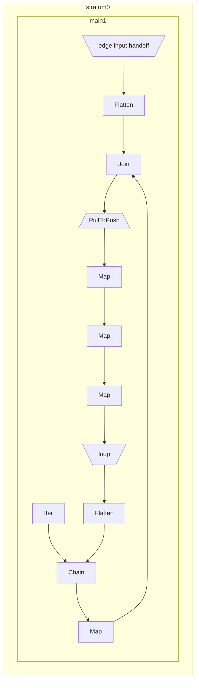

# Graph Reachability

```rust
use hydroflow::builder::prelude::*;

pub fn main() {
    let mut builder = HydroflowBuilder::default();

    let (send_edges, recv_edges) =
        builder.add_channel_input::<_, _, VecHandoff<(usize, usize)>>("edge input");
    let (send_loop, recv_loop) = builder.make_edge::<_, VecHandoff<usize>, _>("loop");

    builder.add_subgraph(
        "main",
        [0].into_hydroflow()
            .chain(recv_loop.flatten())
            .map(|v| (v, ()))
            .join(recv_edges.flatten())
            .pull_to_push()
            .map(|(_old_v, (), new_v)| new_v)
            .inspect(|&v| println!("Reached: {}", v))
            .map(Some)
            .push_to(send_loop),
    );

    let mut hf = builder.build();
    println!("{}", hf.generate_mermaid());

    println!("A");

    send_edges.give(Some((5, 10)));
    send_edges.give(Some((0, 3)));
    send_edges.give(Some((3, 6)));
    send_edges.flush();
    hf.tick();

    println!("B");

    send_edges.give(Some((6, 5)));
    send_edges.flush();
    hf.tick();
}
```

