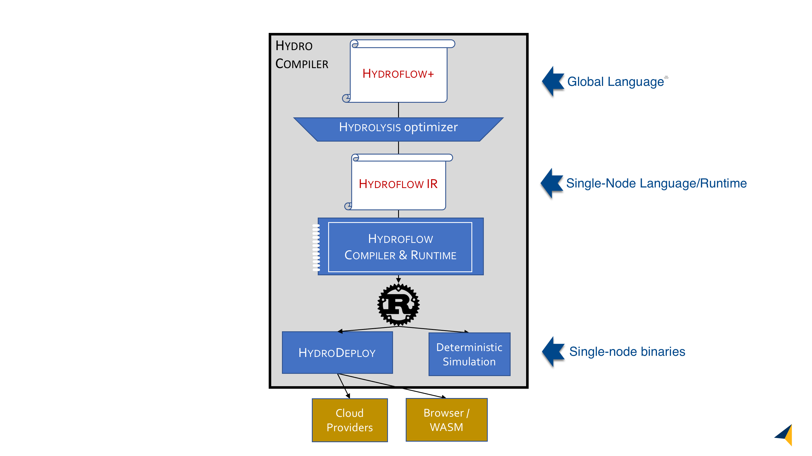

# The Hydro Ecosystem
The Hydro Project is an evolving stack of libraries and languages for distributed programming.
A rough picture of the Hydro stack is below:

Working down from the top:

- [*Hydro*](../hydro) is an end-user-facing high-level [choreographic](https://en.wikipedia.org/wiki/Choreographic_programming) [dataflow](https://en.wikipedia.org/wiki/Dataflow_programming) language. Hydro is a *global* language for programming a fleet of transducers. Programmers author dataflow pipelines that start with streams of events and data, and span boundaries across multiple `process` and (scalable) `cluster` specifications.

- *Hydrolysis* is a compiler that translates a global Hydro spec to multiple single-threaded DFIR programs, which collectively implement the global spec.
This compilation phase is currently a part of the Hydro codebase, but will evolve into a standalone optimizing compiler inspired by database query optimizers and [e-graphs](https://en.wikipedia.org/wiki/E-graph).

- [DFIR and its compiler/runtime](https://github.com/hydro-project/hydroflow/tree/main/dfir_rs) are the subject of this book.
Where Hydro is a *global* language for programming a fleet of processes, DFIR is a *local* language for programming a single process that participates in a distributed system. More specifically, DFIR is an internal representation (IR) language and runtime library that generates the low-level Rust code for an individual transducer. As a low-level IR, DFIR is not intended for the general-purpose programmer. For most users it is intended as a readable compiler target from Hydro; advanced developers can also use it to manually program individual transducers.

- [HydroDeploy](../deploy) is a service for launching DFIR transducers on a variety of platforms.

- Hydro also supports *Deterministic Simulation Testing* to aid in debugging distributed programs. Documentation on this feature is forthcoming.

The Hydro stack is inspired by previous language stacks including [LLVM](https://llvm.org) and [Halide](https://halide-lang.org), which similarly expose multiple human-programmable Internal Representation langauges.
